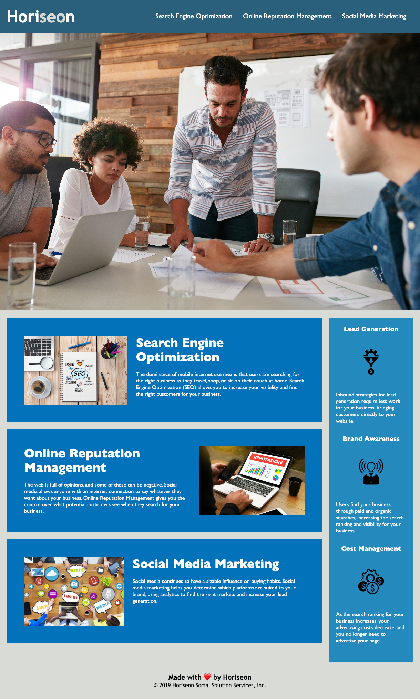

# Marketing Agency; Code Refactor-HTML/CSS

## Description

In this application the webpage meets accessibility standards. I condensed the CSS to not be repetiative 
and be more efficient. In addition, I added a few comments to give details on html elements and CSS optimization changes.

## User Story

```
AS A marketing agency
I WANT a codebase that follows accessibility standards
SO THAT our own site is optimized for search engines
```

## Acceptance Criteria

```
GIVEN a webpage meets accessibility standards
WHEN I view the source code
THEN I find semantic HTML elements
WHEN I view the structure of the HTML elements
THEN I find that the elements follow a logical structure independent of styling and positioning
WHEN I view the icon and image elements
THEN I find accessible alt attributes
WHEN I view the heading attributes
THEN they fall in sequential order
WHEN I view the title element
THEN I find a concise, descriptive title
```

## Mock-Up

The following image shows the web application's appearance and functionality:



## Deploy Application
[Horiseon Marketing Agency](https://jjennifer.github.io/Horiseon-HTML-CSS-Git/#social-media-marketing)


---
© 2023 edX Boot Camps LLC. Confidential and Proprietary. All Rights Reserved.
